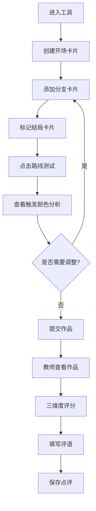

## 1. 产品概述
面向高校游戏设计课程的纯前端互动剧情练习工具，帮助学生通过小型恐怖故事掌握多结局叙事设计与因果链逻辑构建。
- 核心用途：让学生在写剧情前先定义规则，通过可视化卡片和自动路线测试检查叙事逻辑完整性
- 目标用户：游戏设计专业教师与学生，用于课堂练习和作业提交

## 2. 核心功能

### 2.1 用户角色
| 角色 | 核心权限 |
|------|----------|
| 学生 | 创建/编辑故事卡片、运行路线测试、查看分析结果 |
| 教师 | 查看学生作品、在点评区填写评语 |

### 2.2 功能模块
1. **故事卡片区**：场景卡片创建、触发条件编辑、玩家选择与后果定义、卡片拖拽排序
2. **路线测试区**：自动遍历所有剧情分支、卡片触发状态可视化、结局线索充足度分析
3. **课堂点评区**：三维度评分（恐怖规则稳定性/玩家代价可理解性/反转伏笔合理性）、简短评语填写

### 2.3 页面详情
| 页面名称 | 模块名称 | 功能描述 |
|----------|----------|----------|
| 主页 | 故事卡片区 | 卡片列表展示、新增卡片表单（场景名称、触发条件、玩家选择、导致后果、是否为结局）、卡片状态标识 |
| 主页 | 路线测试区 | "开始测试"按钮触发自动遍历、卡片颜色编码（绿色=已触发、灰色=未触发、红色=线索不足结局）、分支路径可视化展示 |
| 主页 | 课堂点评区 | 三项评分滑块/星级、评语输入框、保存按钮、点评历史 |

## 3. 核心流程

### 3.1 学生工作流程
学生进入工具 → 在故事卡片区创建开场卡片 → 逐步添加分支卡片（每个卡片写明触发条件、选项、后果） → 标记结局卡片 → 点击路线测试 → 查看颜色标记的触发分析 → 根据反馈调整卡片 → 提交作品

### 3.2 教师工作流程
教师打开学生作品 → 查看卡片结构与路线测试结果 → 在点评区对三个维度分别评分 → 填写文字评语 → 保存点评

## 4. 用户界面设计

### 4.1 设计风格
- **主色调**：深灰黑 (#1a1a2e) 作为背景，暗红 (#8b0000) 作为强调色，墨绿 (#2d5a3d) 表示正常触发，暗金 (#b8860b) 表示警告
- **按钮风格**：带有微妙内阴影的矩形按钮，悬停时有暗红色发光效果
- **字体**：标题使用 "Cinzel" 或 "Noto Serif SC"（衬线体，营造恐怖文学感），正文使用 "Noto Sans SC"
- **布局风格**：三栏式横向布局（卡片区 / 测试区 / 点评区），每个区域有独立的深色卡片容器
- **图标风格**：使用线条简洁的悬疑风格图标（钥匙、眼睛、磁带、门等符号）

### 4.2 页面设计概述
| 页面名称 | 模块名称 | UI元素 |
|----------|----------|--------|
| 主页 | 故事卡片区 | 卡片列表（竖向堆叠，可拖拽）、新增卡片表单（展开/折叠）、每张卡片显示触发条件和选项标签 |
| 主页 | 路线测试区 | 顶部"运行测试"大按钮、下方树形分支可视化区域、右侧图例说明颜色含义 |
| 主页 | 课堂点评区 | 三项评分条（每项有标题+星级/滑块+说明文字）、多行评语输入框、保存状态指示 |

### 4.3 响应式设计
- 桌面端优先设计（三栏并列布局）
- 平板端：两栏布局（卡片区占满左列，测试区与点评区堆叠在右列）
- 移动端：单列堆叠布局，各区段用折叠面板展开
- 触控优化：卡片支持触屏拖拽，按钮最小触控区域 44px
