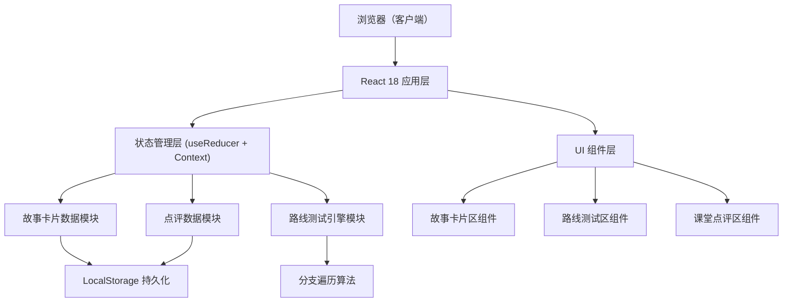
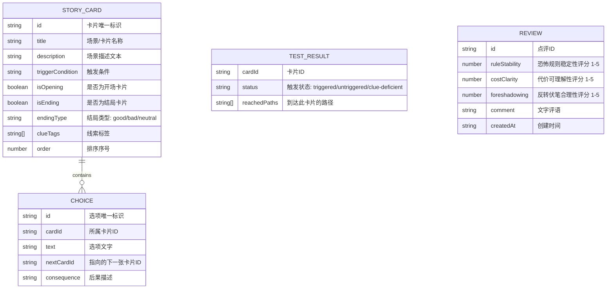

## 1. 架构设计



## 2. 技术说明

- **前端**：React@18 + TypeScript + tailwindcss@3 + vite@5
- **初始化工具**：vite-init (npm create vite@latest)
- **后端**：无（纯前端应用，所有数据本地存储）
- **数据库**：LocalStorage（浏览器本地存储），内置示例数据作为初始模板

## 3. 路由定义

| 路由 | 用途 |
|------|------|
| / | 主页，包含三大模块的单页应用 |

注：本产品为单页应用（SPA），无需多页面路由切换，三个模块以横向分区形式在同一页面展示。

## 4. 数据模型

### 4.1 数据模型定义



### 4.2 核心数据结构 TypeScript 定义

```typescript
type Choice = {
  id: string;
  cardId: string;
  text: string;
  nextCardId: string;
  consequence: string;
};

type StoryCard = {
  id: string;
  title: string;
  description: string;
  triggerCondition: string;
  isOpening: boolean;
  isEnding: boolean;
  endingType?: 'good' | 'bad' | 'neutral';
  clueTags: string[];
  order: number;
  choices: Choice[];
};

type CardTriggerStatus = 'triggered' | 'untriggered' | 'clue-deficient';

type TestResult = {
  [cardId: string]: {
    status: CardTriggerStatus;
    reachedPaths: string[][];
  };
};

type Review = {
  id: string;
  ruleStability: number;
  costClarity: number;
  foreshadowing: number;
  comment: string;
  createdAt: string;
};

type AppState = {
  cards: StoryCard[];
  testResult: TestResult | null;
  review: Review | null;
};
```

## 5. 核心算法说明

### 5.1 路线遍历算法
- 从标记为 `isOpening=true` 的卡片开始
- 使用深度优先搜索（DFS）递归遍历所有 `choices.nextCardId` 指向的卡片
- 记录每条完整路径（从开场到结局）
- 所有被访问过的卡片标记为 `triggered`
- 从未被访问的卡片标记为 `untriggered`

### 5.2 线索充足度检测
- 遍历到达每个结局卡片的所有路径
- 统计路径中经过的所有 `clueTags` 数量
- 若某结局路径中线索标签数 < 2（可配置阈值），标记为 `clue-deficient`
